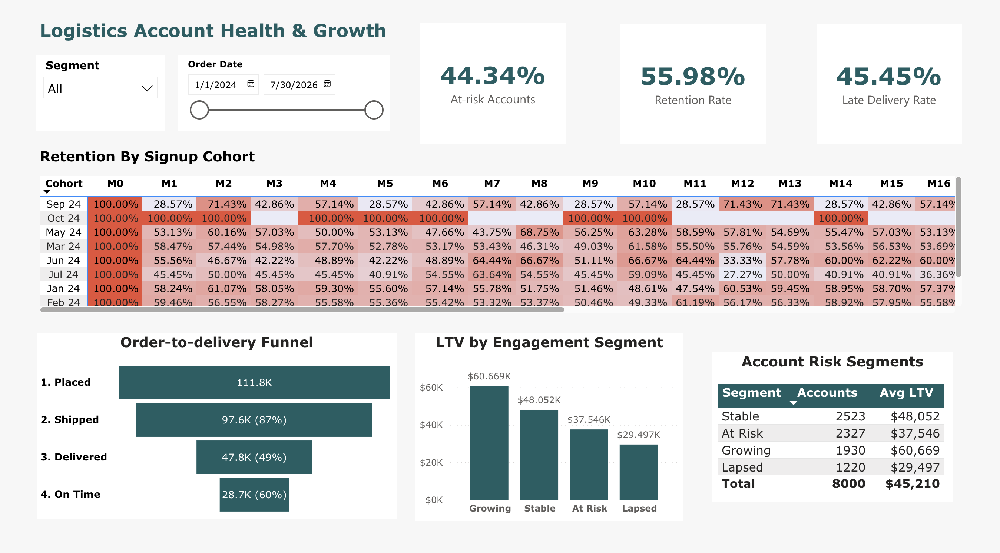

# 🚚 Logistics Account Health & Growth Analytics: End-to-End BigQuery Pipeline & BD Risk Dashboard


An end-to-end account analytics pipeline built with **Google BigQuery, SQL, and Python**, visualized through an interactive **Power BI Account Health Dashboard**. The platform cleans a deliberately messy 223K-row order dataset, models it into a star schema, and answers four core Business Development (BD) questions — delivery funnel performance, cohort retention, churn risk segmentation (RFM), and account lifetime value (LTV) — to identify which accounts need retention attention and where BD should prioritize outreach.

> 📌 **Note:** The working dataset (`dirty_supply_chain_dataset.csv`, 223,300 rows) is synthetically generated by `python/generate_dataset.py`, which reshapes the schema of the public [DataCo Smart Supply Chain dataset](https://www.kaggle.com/datasets/shashwatwork/dataco-smart-supply-chain-for-big-data-analysis) and deliberately injects realistic data-quality problems (ambiguous date formats, mixed currency encodings, inconsistent categorical values, duplicate rows) to practice production-grade cleaning. No real customer or transaction data is used.

---

## 📸 Dashboard Preview



*Single-page account health dashboard: 3 headline KPIs (At-Risk Accounts, Retention Rate, Late Delivery Rate), a full-width cohort retention heatmap, and a bottom row combining the delivery funnel, LTV-by-engagement chart, and account risk segment table. Filterable by Segment and Order Date range.*

🔗 **[Explore the Interactive Power BI Dashboard →](https://app.powerbi.com/groups/me/reports/f08f90d9-17a8-47e3-a957-ff1398b576d4/4ac668596509a7e2d0c6?ctid=246d1169-d80e-4f80-b3ff-c334c35a8798&experience=power-bi)**

---

## 🎯 Business Problem

B2B logistics accounts don't announce when they're about to churn — by the time a shipper's volume visibly drops, Business Development has often already lost the window to intervene. This project answers four questions a BD team needs to act on that risk before it shows up in quarterly revenue:

1. **Delivery Funnel** — Of every order placed, how far through the shipment lifecycle does it actually get, and where is the biggest point of loss?
2. **Cohort Retention** — Do accounts onboarded in a given month keep shipping with us over time, or does engagement decay — and if so, how fast, and does it ever stabilize?
3. **Churn Risk & Segmentation** — Which specific accounts, right now, are trending toward churn — and how does that risk relate to how much revenue they represent?
4. **Lifetime Value (LTV)** — Where should BD concentrate new-business and retention effort — by industry segment, by region, or by something else entirely?

A parallel, ongoing constraint underneath all four — **Data Quality** — asks: how do we get from a genuinely messy 223K-row export (ambiguous dates, five different null representations, mixed currency formats) to numbers a BD stakeholder can trust, without silently dropping data or guessing at values?

---

## 🔑 Key Findings

From **219,571 cleaned order-line records** (after deduplication) spanning **8,000 accounts**, the four analytical modules surfaced:

| Module | Finding | What It Means |
|---|---|---|
| **Delivery Funnel** | 111,814 orders placed → 97,579 shipped (87%) → 47,823 delivered (49% of shipped) → 28,654 delivered on-time (60% of delivered) | The single biggest leak isn't lateness — it's the **Shipped → Delivered** stage, where 51% of shipped orders never reach a completed-delivery status at all. |
| **Cohort Retention** | Retention drops sharply in month 1, then stabilizes into a noisy **~56% plateau** (dashboard KPI: 55.98%) through month 12+, rather than continuing to decay | The critical retention-intervention window is the first 30 days post-onboarding, not ongoing win-back efforts at month 6+. |
| **Churn Risk (RFM)** | **44.34% of accounts (3,547 of 8,000)** are segmented "At Risk" or "Lapsed"; average account value declines monotonically across segments — Growing $60.7K → Stable $48.1K → At Risk $37.5K → Lapsed $29.5K (overall average across all accounts: $45,210) | Engagement level (recency/frequency/monetary) predicts account value **far better** than any firmographic attribute — this is the strongest, most actionable finding in the project. |
| **LTV** | LTV shows **no meaningful variation** by customer segment (Consumer/Corporate/Home Office) or by shipping region (tight $44K–$46K band across every group) | Tested and ruled out as a targeting axis — BD should prioritize by engagement/RFM segment, not industry or geography. A dedicated "LTV Gap" KPI card was considered but cut from the dashboard as redundant with the LTV-by-segment chart already showing all four segments. |
| **Delivery reliability by mode/region** | Late-delivery rate is flat (dashboard KPI: 45.45%) across every shipping mode and every region (44.8%–46.1% band) | No single carrier, mode, or lane explains delay risk — the issue is systemic, not localized. Tested and ruled out rather than assumed. |


---

## 💡 Recommendations

| Priority | Finding | Recommended Action |
|---|---|---|
| Immediate | 3,547 accounts (44.3%) are At Risk or Lapsed | Use the account-level risk table (sorted by `monetary` descending) as a prioritized BD call list — reach the highest-value at-risk accounts first |
| Immediate | Engagement segment predicts value 2.1x better than firmographic segment | Reprioritize BD account-assignment strategy around RFM/engagement tier, not industry vertical or region |
| Operational | Retention decay is concentrated in month 0→1, then plateaus | Concentrate onboarding/early-engagement resources (check-in calls, proactive support) in the first 30 days, not on later win-back campaigns |
| Product/Ops | 51% of shipped orders don't reach "delivered" status — a bigger leak than on-time performance | Investigate order-completion friction (cancellations, holds, stuck-in-processing) as a distinct problem from delivery lateness |
| De-prioritize | Late-delivery rate is uniform across mode/region; LTV is uniform across segment/region | Don't invest in mode-specific or region-specific fixes on the strength of this data alone — neither dimension explains the variation BD would expect |

Full reasoning and supporting SQL for each: see [Technical Documentation](docs/TechnicalDocumentation.md#recommendations).

---

## 🧰 Tech Stack

`Google BigQuery` · `SQL (window functions, RFM scoring, star schema modeling)` · `Python (pandas, NumPy, Faker)` · `Power BI (DAX, matrix conditional formatting, funnel visuals)` · `Data Quality / Cleaning Framework`

---

## 🚀 Quick Start

```bash
# 1. Clone and set up a virtual environment
git clone https://github.com/ericgalbarn/logistics-account-analytics.git
cd end-to-end-logistics-analytics
python3 -m venv venv
source venv/bin/activate
pip install -r requirements.txt

# 2. Generate the dirty synthetic dataset (or use the one already in the repo)
python python/generate_dataset.py --rows 220000 --customers 8000 --products 500 --out dirty_supply_chain_dataset.csv

# 3. Load dirty_supply_chain_dataset.csv into a BigQuery table, then run the SQL
#    pipeline in order against that table:
#    sql/01_data_cleaning.sql        -> stg_orders_final (keys/IDs/dates, delivery/status,
#                                        money/quantity, segmentation dimensions)
#    sql/02_fact_order_item.sql      -> fact_order_item (with impossible-date correction)
#    sql/03_dim_date.sql             -> dim_date
#    sql/04_dim_customer.sql         -> dim_customer
#    sql/05_dim_product.sql          -> dim_product
#    sql/06_data_validation.sql      -> referential integrity checks
#    sql/07_funnel_mart.sql          -> mart_funnel      (+ sql/08 validation)
#    sql/09_mart_cohort.sql          -> mart_cohort      (+ sql/10 validation)
#    sql/11_mart_churn_rfm.sql       -> mart_churn_rfm   (+ sql/12 validation)
#    sql/13_mart_ltv.sql             -> mart_ltv         (+ sql/14 validation)

# 4. Connect Power BI to BigQuery and import the 4 mart views + dim_customer/dim_date
#    to build the dashboard (funnel visual, cohort matrix with conditional formatting,
#    churn-risk table, LTV column chart, KPI cards, slicers).
```

📖 **Full step-by-step guide with expected outputs and validation numbers:** [docs/TechnicalDocumentation.md](docs/TechnicalDocumentation.md#execution-guide)

---

## 📁 Repository Structure

```
end-to-end-logistics-analytics/
│
├── README.md                        # You are here
├── requirements.txt                 # Python dependencies
│
├── docs/
│   └── TechnicalDocumentation.md    # Full methodology, SQL walkthroughs, data dictionarydocum
├── powerbi/
│   └── LogisticsDashboard.pbix    # PowerBI Dashboard files
│
├── dataset/
│   ├── DataCoSupplyChainDataset.csv       # Public reference dataset (schema source)
│   └── DescriptionDataCoSupplyChain.csv   # Column descriptions for the reference dataset
│
├── dirty_supply_chain_dataset.csv   # Working dataset: 223,300 rows, deliberately dirty
│
├── python/
│   └── generate_dataset.py          # Synthetic dirty-data generator (Faker-based)
│
└── sql/
    ├── 01_data_cleaning.sql             # Keys/IDs/dates, delivery/status, money/quantity,
    │                                      segmentation — 4 sections, diagnose-then-fix
    ├── 02_fact_order_item.sql           # fact_order_item build (+ impossible-date correction)
    ├── 03_dim_date.sql                  # dim_date (generated calendar table)
    ├── 04_dim_customer.sql              # dim_customer
    ├── 05_dim_product.sql               # dim_product
    ├── 06_data_validation.sql           # Star-schema referential integrity checks
    ├── 07_funnel_mart.sql               # mart_funnel (Module 1)
    ├── 08_validation_funnel_mart.sql    # Funnel validation queries
    ├── 09_mart_cohort.sql               # mart_cohort (Module 2, right-censoring-safe)
    ├── 10_validation_mart_cohort.sql    # Cohort validation queries
    ├── 11_mart_churn_rfm.sql            # mart_churn_rfm (Module 3, RFM segmentation)
    ├── 12_validation_mart_churn_rfm.sql # Churn/RFM validation queries
    ├── 13_mart_ltv.sql                  # mart_ltv (Module 4)
    └── 14_validation_mart_ltv.sql       # LTV validation queries
```

---

## License

This project is licensed under the **MIT License**.

- **Code (.py, .sql):** Free to modify, distribute, and use for commercial or private purposes.
- **Power BI (.pbix):** Free to download, view, and reuse the data model and report layouts.

Attribution appreciated — please link back to this repository if you use this work.